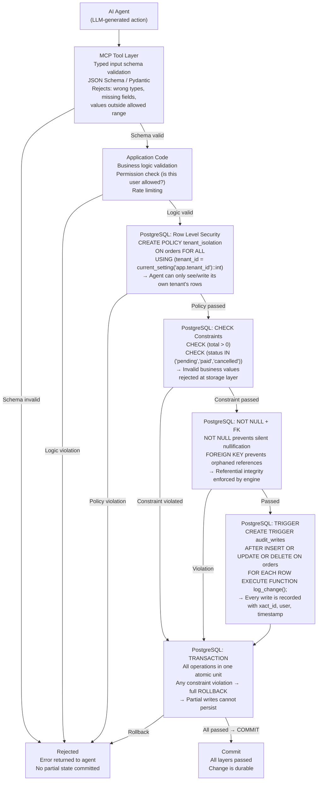

# Agent Safety Model

How a bad agent action is blocked at each layer before it can corrupt data. Each layer is an independent safety gate — a bypass at one layer should be caught by the next.



## What each layer stops

| Layer | What it prevents |
|-------|-----------------|
| MCP typed input validation | Malformed requests — wrong data types, missing required fields, out-of-range values. Stops bad input before it ever reaches the database. |
| Application code | Business rule violations — e.g., an agent trying to cancel an already-shipped order. |
| RLS policies | Cross-tenant data access — an agent acting as tenant A cannot read or write tenant B's rows even if it constructs a direct SQL query. |
| CHECK constraints | Invalid domain values — negative prices, invalid status strings, impossible date ranges. |
| NOT NULL + FK | Incomplete or dangling data — cannot create an order with no user_id, cannot reference a non-existent product. |
| TRIGGER (audit log) | Not a blocking layer, but ensures every write has an immutable audit trail. The trigger fires inside the same transaction. |
| TRANSACTION | All-or-nothing semantics — if any constraint fails mid-operation, the entire transaction is rolled back and no partial state persists. |

## Human approval gate (recommended for destructive operations)

For MCP tools that perform `DELETE`, `TRUNCATE`, bulk `UPDATE`, or `DROP`, add an explicit human approval step before the SQL is executed. This is a process control above the database layer:

```
Agent proposes: DELETE FROM orders WHERE created_at < '2020-01-01'
→ MCP tool estimates rows affected (SELECT count(*))
→ Returns count to human operator
→ Human confirms or rejects
→ Only on explicit approval does the DELETE execute
```
