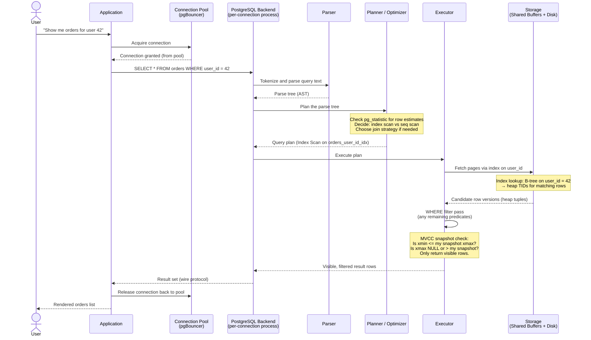

# Application-to-Database Flow

Sequence diagram tracing a query from user action to database response, including connection pooling, query planning, index lookup, MVCC snapshot check, and result return.

## Notes on each step

| Step | What happens |
|------|-------------|
| Connection Pool | Reuses existing backend connections instead of spawning a new process per request. Critical for high-concurrency apps. |
| Parser | Converts SQL text into an internal AST. Syntax errors are caught here. |
| Planner | Chooses the cheapest plan based on table statistics (`pg_statistic`). Uses cost estimates (seq_page_cost, random_page_cost, cpu_tuple_cost). |
| Index lookup | The executor navigates the B-tree to find heap TIDs matching `user_id = 42`, then fetches those pages from shared buffers or disk. |
| WHERE filter | Remaining predicates not satisfied by the index are re-evaluated on the fetched rows. |
| MVCC snapshot check | Each row version has `xmin` (inserted by transaction) and `xmax` (deleted by transaction). The executor checks visibility against its snapshot to ensure read consistency without locking. |
| Result return | Rows are sent back over the PostgreSQL wire protocol (libpq). The pool reclaims the connection for the next query. |
