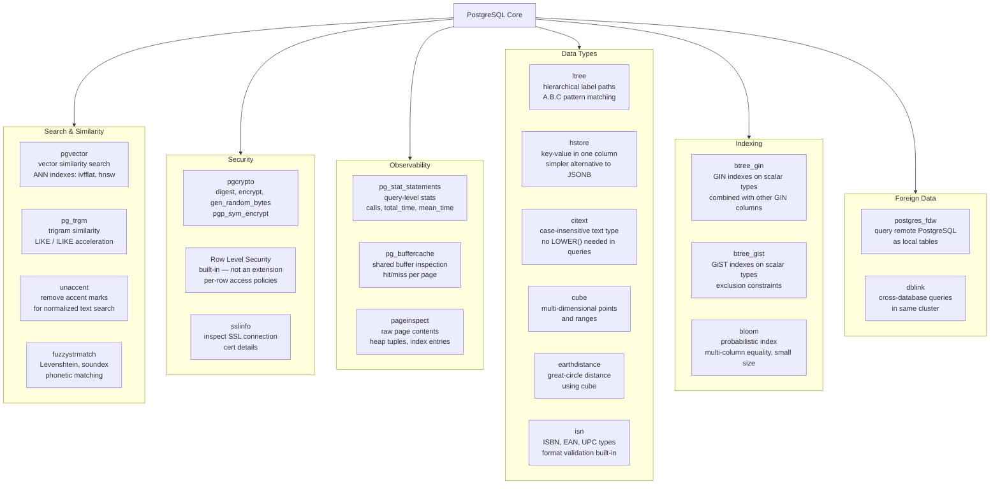

# PostgreSQL Extension Ecosystem Map

PostgreSQL's extension system allows adding types, functions, operators, and index methods without modifying the core server. This diagram categorizes the most useful extensions by purpose.



## Installation pattern

```sql
-- Check if available
SELECT name, default_version FROM pg_available_extensions WHERE name = 'pgvector';

-- Install (requires superuser or pg_extension_owner role)
CREATE EXTENSION IF NOT EXISTS pgvector;
CREATE EXTENSION IF NOT EXISTS pg_trgm;
CREATE EXTENSION IF NOT EXISTS unaccent;
CREATE EXTENSION IF NOT EXISTS pg_stat_statements;  -- also needs shared_preload_libraries

-- List installed extensions
SELECT extname, extversion FROM pg_extension ORDER BY extname;
```

## Key notes

- `pg_stat_statements` requires `shared_preload_libraries = 'pg_stat_statements'` in `postgresql.conf` and a server restart before `CREATE EXTENSION` works.
- `pgvector` must be compiled and installed at the OS level before it appears in `pg_available_extensions`.
- `earthdistance` depends on `cube` — install `cube` first.
- `RLS` is a core PostgreSQL feature (not an extension) but is listed here for completeness as a security capability.
