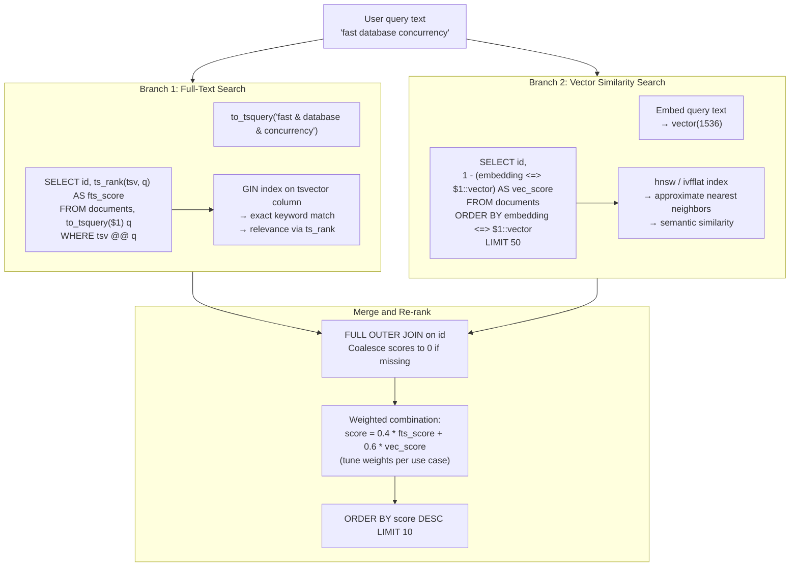

# Hybrid Search Flow

Combine Full-Text Search (FTS) and vector similarity search to get both keyword precision and semantic recall.

## Parallel search branches



## SQL implementation

```sql
WITH fts AS (
    SELECT
        id,
        ts_rank(search_vector, query) AS fts_score
    FROM documents, to_tsquery('english', $1) AS query
    WHERE search_vector @@ query
),
semantic AS (
    SELECT
        id,
        1 - (embedding <=> $2::vector) AS vec_score
    FROM documents
    ORDER BY embedding <=> $2::vector
    LIMIT 50
),
combined AS (
    SELECT
        COALESCE(fts.id, semantic.id) AS id,
        COALESCE(fts.fts_score, 0)   AS fts_score,
        COALESCE(semantic.vec_score, 0) AS vec_score
    FROM fts
    FULL OUTER JOIN semantic USING (id)
)
SELECT
    d.id,
    d.content,
    (0.4 * fts_score + 0.6 * vec_score) AS hybrid_score
FROM combined
JOIN documents d USING (id)
ORDER BY hybrid_score DESC
LIMIT 10;
```

## When to use each branch alone vs combined

| Scenario | Recommended |
|----------|-------------|
| Exact term must appear in result | FTS only or hybrid with high FTS weight |
| Synonyms and paraphrases matter | Vector only or hybrid with high vector weight |
| General-purpose search | Hybrid (balanced weights) |
| Code search (identifiers) | FTS (exact token match) |
| Question answering / RAG | Vector (semantic intent matching) |

## Schema required

```sql
-- Add both a tsvector column and a vector column
ALTER TABLE documents
    ADD COLUMN search_vector tsvector
        GENERATED ALWAYS AS (to_tsvector('english', content)) STORED,
    ADD COLUMN embedding vector(1536);

CREATE INDEX ON documents USING GIN (search_vector);
CREATE INDEX ON documents USING hnsw (embedding vector_cosine_ops);
```
