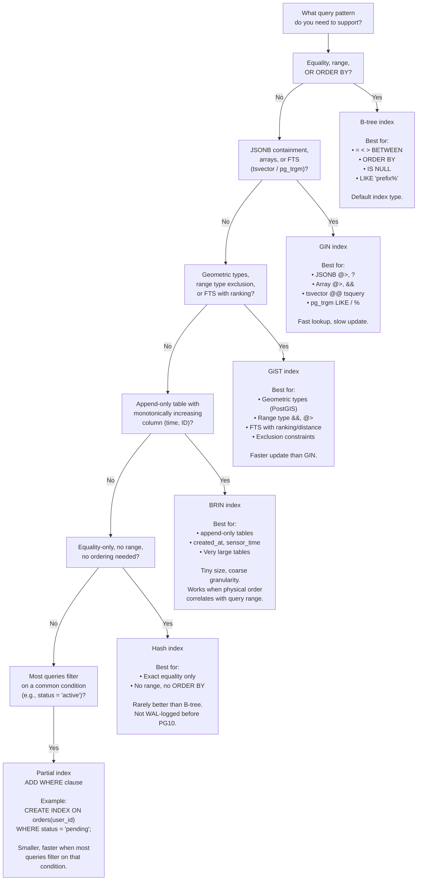

# Index Selection Flow

Decision flowchart for choosing the right PostgreSQL index type for your query pattern.



## Quick reference table

| Index type | Operators | Size | Update cost | Notes |
|------------|-----------|------|-------------|-------|
| B-tree | `=`, `<`, `>`, `BETWEEN`, `LIKE 'x%'` | Medium | Low | Default; use for almost everything |
| GIN | `@>`, `?`, `@@`, `%` | Large | High | Bulk-load then index; use `fastupdate` |
| GiST | `&&`, `@>`, `<->` (distance) | Medium | Medium | Exclusion constraints require GiST |
| BRIN | `=`, range on correlated data | Tiny | Very low | 128-page block ranges by default |
| Hash | `=` only | Medium | Low | Almost never preferred over B-tree |
| Partial | Any (adds WHERE filter) | Small | Low | Combine with any of the above |

## Diagnosing index usage

```sql
-- See which indexes exist and their sizes
SELECT indexname, pg_size_pretty(pg_relation_size(indexrelid)) AS size
FROM pg_stat_user_indexes
WHERE relname = 'orders';

-- See which indexes are NOT being used (candidates for removal)
SELECT indexrelname, idx_scan
FROM pg_stat_user_indexes
WHERE relname = 'orders'
ORDER BY idx_scan ASC;

-- Confirm the planner uses your index
EXPLAIN (ANALYZE, BUFFERS)
SELECT * FROM orders WHERE user_id = 42;
```
