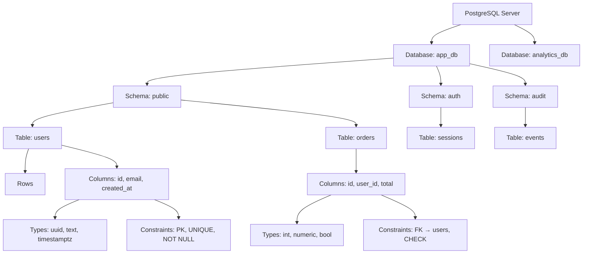
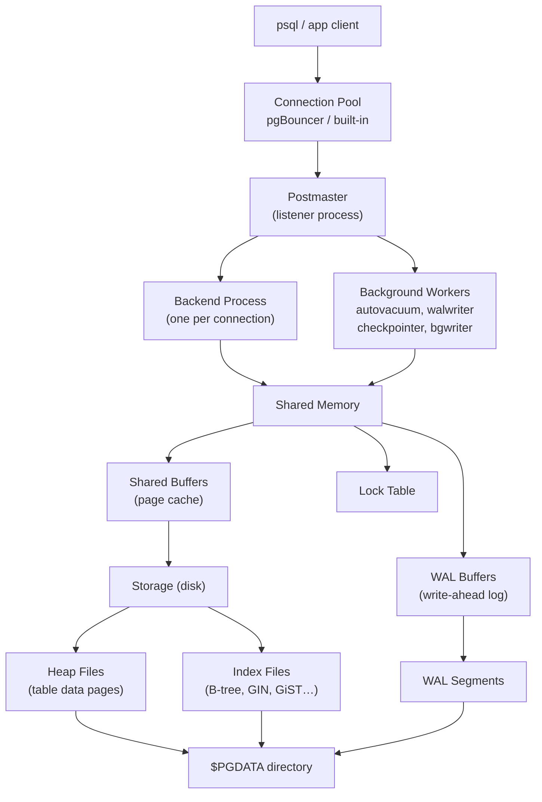

# PostgreSQL Mental Model

A high-level map of the two main dimensions of PostgreSQL: the **logical object hierarchy** (what you store) and the **process/memory architecture** (how PostgreSQL runs).

## Logical Object Hierarchy

## Process and Memory Architecture

## Key Takeaways

- Every client connection spawns one **backend process** — PostgreSQL is process-based, not thread-based.
- **Shared Buffers** is the main in-memory page cache; reads/writes go through it before touching disk.
- **WAL (Write-Ahead Log)** ensures durability: changes are logged before they are applied to heap files.
- **Schemas** are namespaces inside a database — they let you organize tables without creating separate databases.
- **Constraints** live on columns and tables, enforcing correctness at the storage layer regardless of the application.
