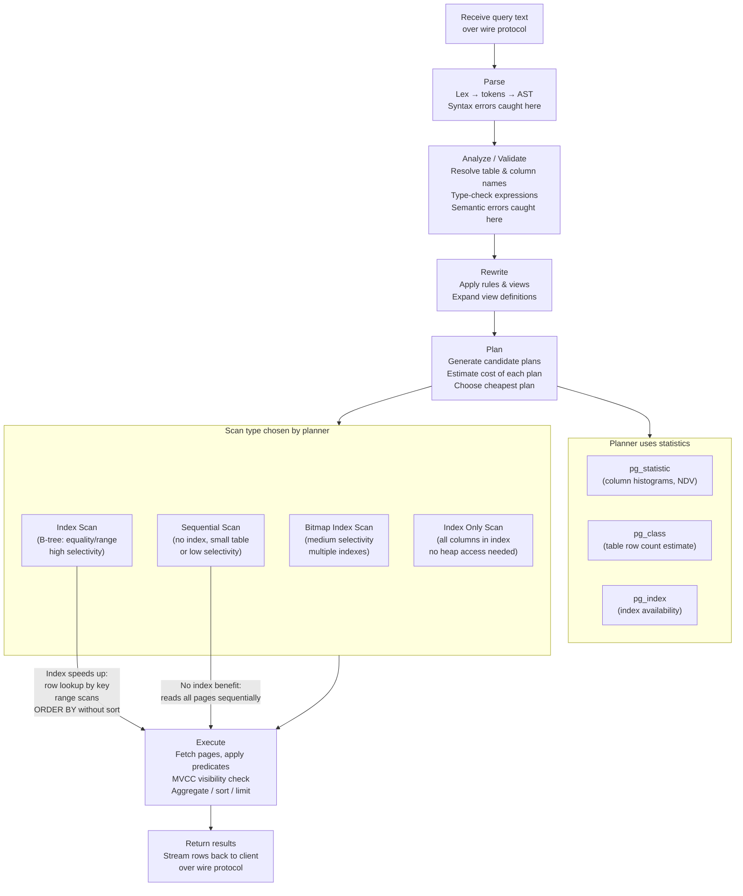
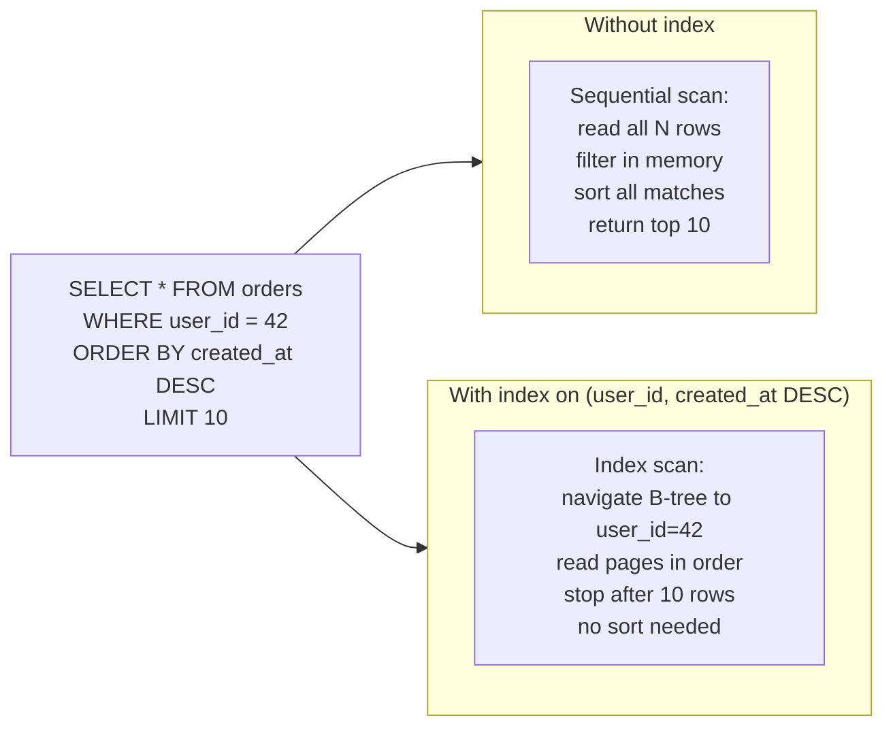

# SQL Query Lifecycle

What happens inside PostgreSQL from the moment a query string arrives to the moment results are returned.



## Where indexes make a difference



## Planner cost model (simplified)

| Factor | Default cost unit |
|--------|------------------|
| Sequential page read | 1.0 (seq_page_cost) |
| Random page read (index) | 4.0 (random_page_cost) |
| Per-row CPU processing | 0.01 (cpu_tuple_cost) |
| Per-row operator evaluation | 0.0025 (cpu_operator_cost) |

The planner multiplies estimated rows by these costs and picks the plan with the lowest total. This is why a large table with a highly selective index wins over a sequential scan, but a small table often favors a sequential scan even with an available index.

## How to inspect the chosen plan

```sql
EXPLAIN SELECT * FROM orders WHERE user_id = 42 ORDER BY created_at DESC LIMIT 10;
EXPLAIN (ANALYZE, BUFFERS) SELECT ...;  -- run the query and show actual times and buffer hits
```
