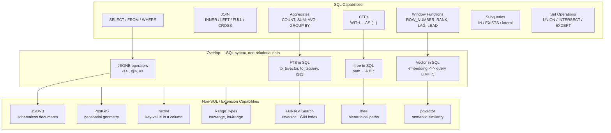

# SQL vs Non-SQL Capability Map

PostgreSQL is more than a SQL engine. This diagram maps the boundary between classic relational SQL capabilities and the non-relational superpowers PostgreSQL adds, including where they overlap.

## Reading the diagram

- **Left block (SQL Capabilities):** Standard relational SQL — these work identically in any compliant RDBMS.
- **Middle block (Overlap):** You write SQL syntax, but the operators and types are PostgreSQL-specific extensions. This is where PostgreSQL's power shines — you get the full relational query engine (joins, CTEs, aggregates) applied to structured, document, vector, or hierarchical data.
- **Right block (Non-SQL Capabilities):** Extension-backed types and indexes that go beyond what standard SQL defines. The data model changes, but you still query with SQL.

## Practical implications

| Capability | When to reach for it |
|------------|---------------------|
| Standard SQL | Always — it is the foundation |
| JSONB | Schema is unknown at design time or evolves rapidly |
| FTS | Users type search terms; you need relevance ranking |
| pgvector | Semantic search, recommendations, RAG pipelines |
| ltree | Org charts, product categories, comment threads |
| PostGIS | Location data, radius search, geofencing |
| Range types | Time windows, price bands, IP address ranges |
