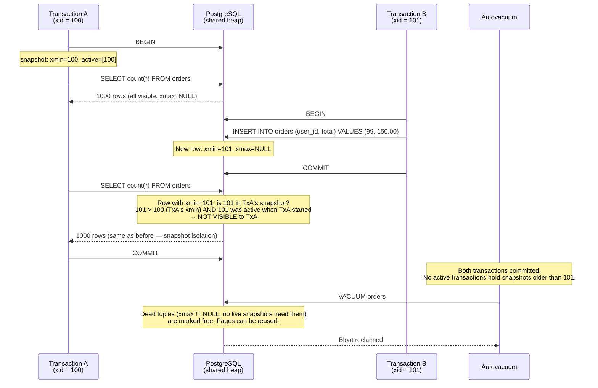
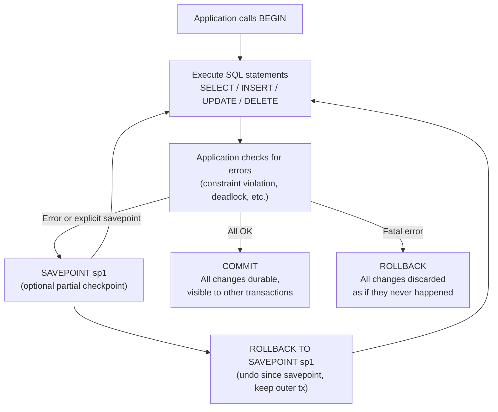

# Transaction and MVCC Flow

How PostgreSQL uses Multi-Version Concurrency Control (MVCC) to give each transaction a consistent snapshot without locking readers.

## MVCC Snapshot Isolation



## Transaction Control Flow



## MVCC row visibility rules

| Condition | Visible? |
|-----------|---------|
| `xmin` committed AND `xmax` is NULL | Yes — row is live |
| `xmin` committed AND `xmax` committed AND `xmax` > snapshot | Yes — deleted after our snapshot |
| `xmin` committed AND `xmax` committed AND `xmax` <= snapshot | No — deleted before our snapshot |
| `xmin` in-progress (not yet committed) | No — row is not yet real |
| `xmin` aborted | No — row was never committed |

## Why VACUUM is necessary

MVCC never overwrites rows in place. An UPDATE creates a new row version (`xmin = current_xid`) and marks the old one dead (`xmax = current_xid`). Dead row versions accumulate — they cannot be reclaimed until no live transaction's snapshot could still need them. VACUUM finds and marks those dead tuples as free space for future inserts.

Without VACUUM (or autovacuum), tables grow indefinitely even if net row count is stable. This is called **table bloat**.

```sql
-- See dead tuple accumulation
SELECT relname, n_live_tup, n_dead_tup, last_autovacuum
FROM pg_stat_user_tables
ORDER BY n_dead_tup DESC;
```
