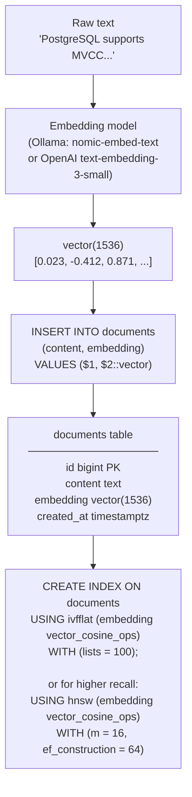
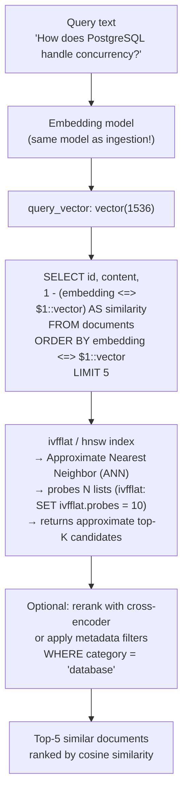

# Vector Search Flow

End-to-end flow for semantic similarity search using pgvector, from raw text to ranked results.

## Ingestion flow (storing documents with embeddings)



## Query flow (finding similar documents)



## Distance operators

| Operator | Meaning | Index support |
|----------|---------|---------------|
| `<=>` | Cosine distance (1 - similarity) | ivfflat/hnsw with `vector_cosine_ops` |
| `<->` | L2 (Euclidean) distance | ivfflat/hnsw with `vector_l2_ops` |
| `<#>` | Negative inner product | ivfflat/hnsw with `vector_ip_ops` |

## ivfflat vs hnsw trade-offs

| | ivfflat | hnsw |
|--|---------|------|
| Build time | Fast | Slow |
| Memory | Low | High |
| Recall | Good (tune `probes`) | Excellent |
| Update | Full rebuild recommended | Supports incremental |
| Best for | Large batch ingestion | Real-time updates, high recall |

## Minimal working example

```sql
CREATE EXTENSION IF NOT EXISTS vector;

CREATE TABLE documents (
    id         bigserial PRIMARY KEY,
    content    text NOT NULL,
    embedding  vector(1536)
);

CREATE INDEX ON documents
USING hnsw (embedding vector_cosine_ops)
WITH (m = 16, ef_construction = 64);

-- Insert (embedding generated by application)
INSERT INTO documents (content, embedding)
VALUES ('PostgreSQL uses MVCC for concurrency', '[0.023, -0.412, ...]'::vector);

-- Query
SELECT content, 1 - (embedding <=> '[0.019, -0.398, ...]'::vector) AS similarity
FROM documents
ORDER BY embedding <=> '[0.019, -0.398, ...]'::vector
LIMIT 5;
```
